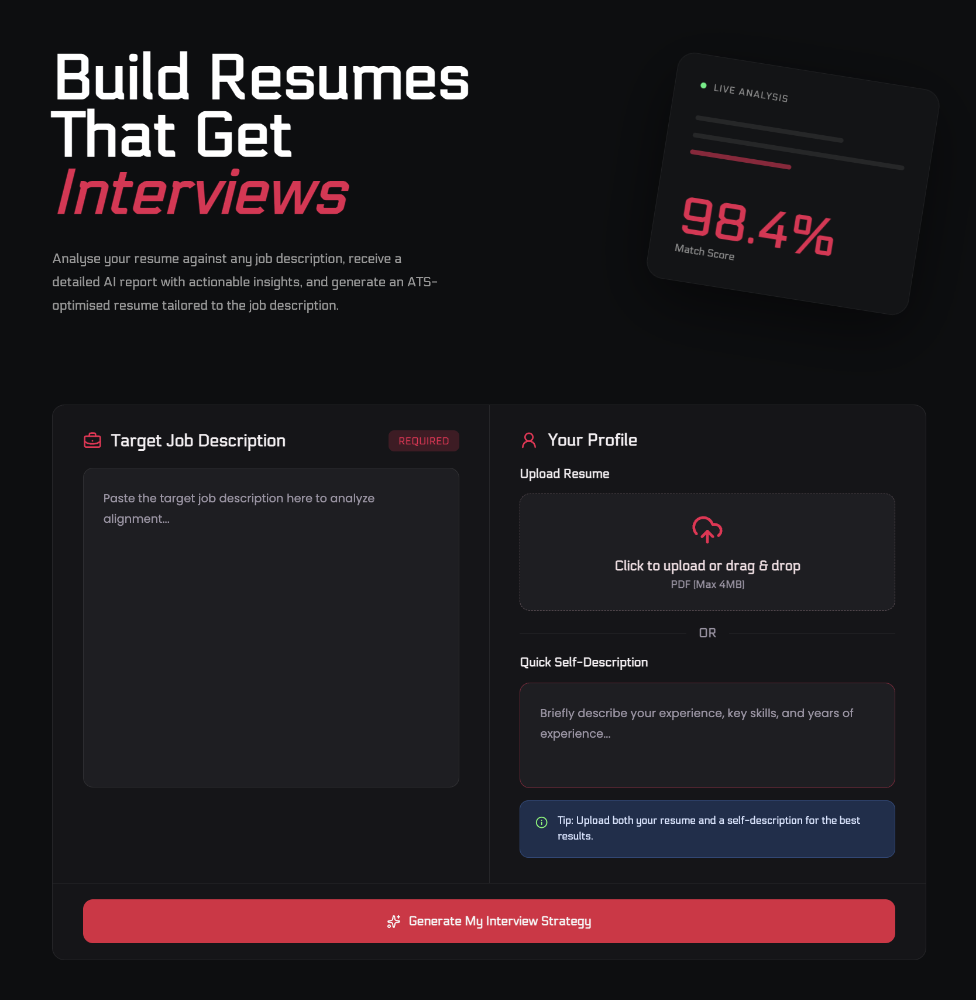
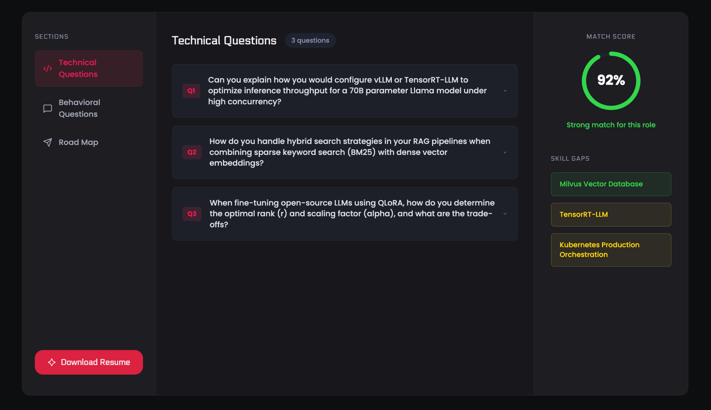

# HireSprint


> AI-powered resume analysis, personalised interview preparation, and ATS-optimised resume generation.

HireSprint helps job seekers improve every application by analysing resumes against job descriptions, generating comprehensive AI reports, identifying skill and keyword gaps, and creating tailored ATS-friendly resumes.

<br/>
<table>
<tr>
<td></td>
<td></td>
</tr>
</table>
<br/>

> **Note:** This project uses Render's free tier for backend hosting. The first request after a period of inactivity may take 30–60 seconds while the server wakes up. Once it's running, the application responds normally.

## ✨ Features

### AI Resume Analysis
- Analyse your resume against any job description to measure its relevance, identify missing skills, uncover keyword gaps, and evaluate ATS compatibility.

### Comprehensive Resume Report
- Receive a detailed AI-generated report with resume strengths, improvement opportunities, ATS insights, keyword analysis, skill gap assessment, and personalised recommendations.

### ATS-Optimised Resume Generation
- Generate a tailored, ATS-friendly resume customised for each job description, highlighting the most relevant skills, experience, and achievements.

### Interview Preparation
- Prepare with AI-generated technical and behavioural interview questions based on the target role, along with sample answers and role-specific practice material.

### Personalised Preparation Plan
- Get a structured preparation roadmap that prioritises skills to improve, topics to revise, and interview readiness, helping you focus on what matters most before applying.

### Simple End-to-End Workflow
- Upload your resume, paste a job description, and receive a complete analysis, interview preparation resources, and an optimised resume—all in one place.

## 🛠 Built With

### Frontend
- React
- Vite
- SCSS
- Axios

### Backend
- Node.js
- Express.js
- MongoDB
- Mongoose

### AI
- Google Gemini API (`@google/genai`)

### Authentication & Security
- JSON Web Tokens (JWT)
- bcryptjs
- HTTP-only Cookies
- Cookie Parser
- CORS
- dotenv

### File & Document Processing
- Multer (File Uploads)
- pdf-parse (Resume Parsing)
- Puppeteer (PDF Generation)

## 🚀 Getting Started

Clone the repository:

```bash
git clone https://github.com/Kunal241207/HireSprint.git
cd HireSprint
```

Install dependencies for both the frontend and backend:

```bash
cd frontend
npm install

cd ../backend
npm install
```

Start the application:

```bash
# backend
npm run dev

# frontend
npm run dev
```

## 🤝 Contributing

Contributions, bug reports, and feature suggestions are always welcome. Feel free to fork the repository, open an issue, or submit a pull request.

## ⭐ Support

If you found HireSprint useful, consider starring the repository to support the project.
